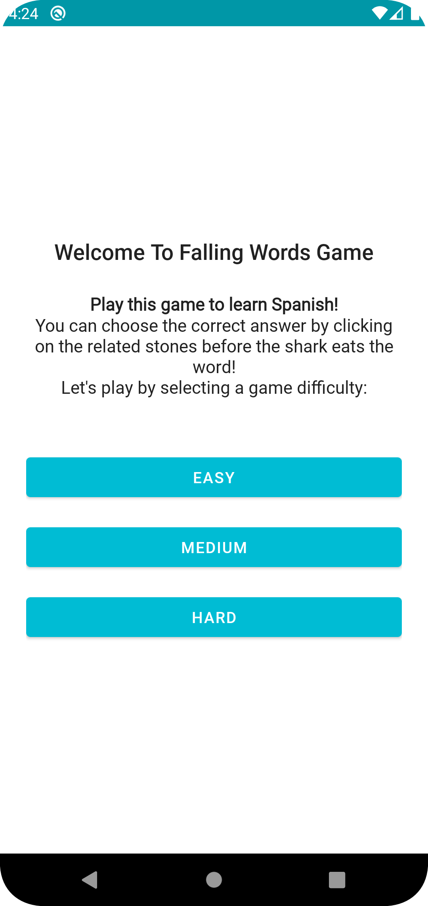
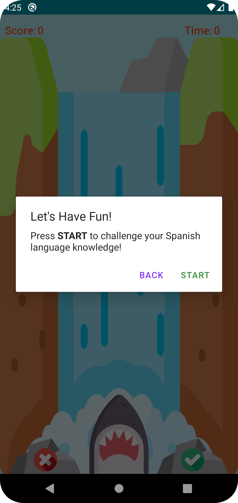
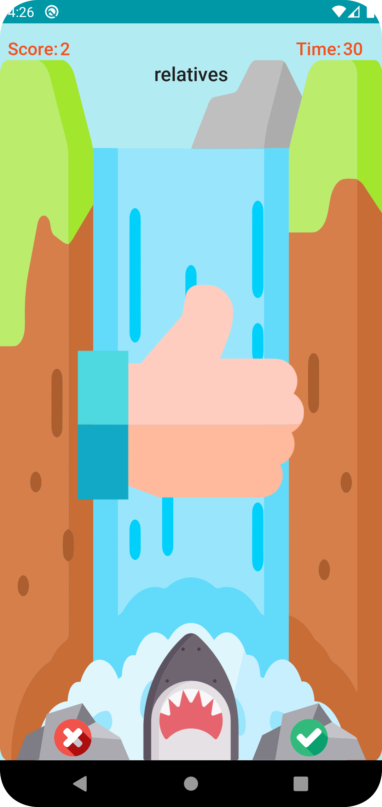
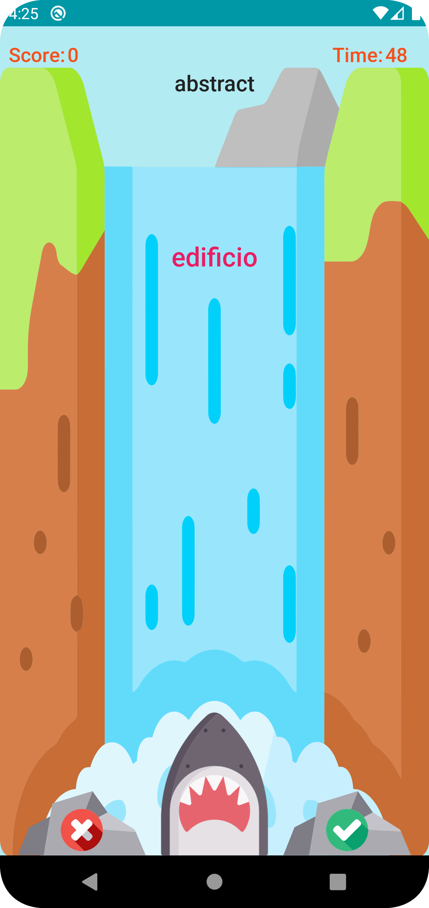

# Falling Words

This is a simple Android game in which the player can learn Spanish through it!
The game scenario is that the player should prevent the words which will be fallen from the
waterfall to be eaten by the shark.

## Technologies and Libraries

- Kotlin
- ViewModel
- Kotlin Coroutines
- ViewBinding (for better performance in comparison to DataBinding)
- Hilt (for dependency injection)
- Material Design
- Navigation Component
- Jetpack libraries
- Gson
- Arrow
- Junit
- Mockito
- Espresso

## Architecture

This application is developed using MVVM along with Clean Architecture and also, SOLID principles are respected.
- **MVVM**: Nowadays, this architecture is recommended for Android projects which removes the tight coupling between each component. According to MVVM, we have Model, View, and ViewModel layers.
    - Model: It represents the data from a local or remote data source.
    - View: It consists of UI-related codes (Activity or Fragment) and observes the ViewModel
      for data changes.
    - ViewModel: It is a bridge between View and Model layers and exposes changes through observables and View can observe them.
- **Clean Architecture**: Clean architecture principles are followed in this project. The merit of using these principles are separation of concerns, loose coupling, testable, and scalable codes. According to Clean Architecture, the dependency of the layers is like this: APP ->  DOMAIN -> DATA. This architecture is identical to Onion Architecture and an inner layer could not access an upper layer. In this project, the APP, DATA, and DOMAIN layers are defined in separate packages to decrease complexity. Of course, these packages could move to separate modules if we want to choose the layer-by-module pattern.

## Implementation

This game contains two screens implemented by fragments and the whole logic is in the view models. For reactive programming and asynchronous works, Kotlin Coroutines is selected. Also, unit tests are implemented for the classes.

- `WelcomeFragment`: This is the first screen that the user will face to it after opening the app. There is a brief description of the game. The user can start the game by choosing one of the game's difficulties.
    - **Easy**: 5 questions and 50 seconds.
    - **Medium**: 10 questions and 100 seconds.
    - **Hard**: 15 questions and 150 seconds.
- `WelcomeViewModel`: This class is responsible for its view events.
- `GameFragment`: This fragment shows the game UI, components, alert dialogs and animates view components according to the conditions.
- `GameViewModel`: Once this class instantiates, the data will be get from the corresponding use case and starts the game if everything goes well. All logic of the game is implemented here.
- `QuestionsUseCase`: It contains the business logic where the data get from the corresponding repository and map to the Question model.
- `WordsRepository`: Responsible for reading data from the JSON file and converting it to a list.

## Time Allocation

- I have spent about 8 hours on the app.
- (1:30 hour) for implementing repository and use case.
- (30 minutes) for creating a Welcome screen.
- (3:45 hour) for developing game scenarios and logic.
- (1:30 hour) for writing tests both unit-testing and UI-testing.
- (45 minutes) for documentation.

## To Improve

Due to time limitations, I would like to make a variety of improvements and some of which are:

- Gameplay and UI improvements.
- Adding sounds to the game to make it more attractive.
- More fancy animations. (for example, using Lottie)
- Adding more languages.
- Getting new words from an end-point and persisting them into a local database for supporting offline mode.
- Increase test coverage, especially UI tests.
- Capability of sharing the game results.
- Supporting different screen sizes.

## Screenshots

<table>
  <tr>
    <td></td>
    <td></td>
    <td></td>
    <td></td>
  </tr>
</table>